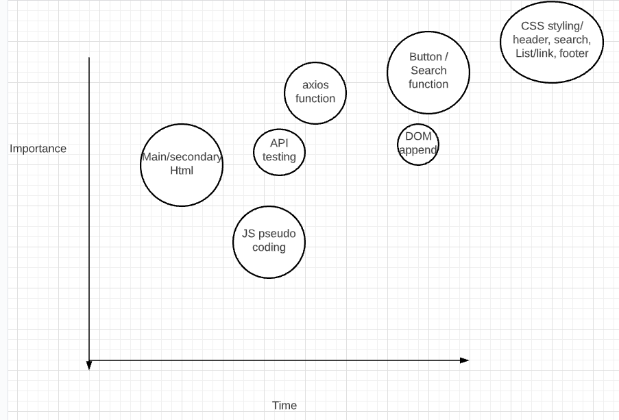

# News App

# Overview

## Name

Moschetti News Page!

## App Description


This app will pull information from News API and return and appenend titles, images, and links, from multiple news sources around the world based on users input via a list. ie... if you type in donald trump it will pull up top news articles about him from around the world. The app will then append the news articles to the DOM and enable you to open them within the same page. 

## API and Data Sample 

https://newsapi.org/

API sample of below code snippet. 

http://newsapi.org/v2/top-headlines?q=tesla&from=2021-02-22&sortBy=publishedAt&apiKey=590e2f3ad3a7403499ccbcd8a5986d5f


```json
"articles": [
        {
            "source": {
                "id": "the-next-web",
                "name": "The Next Web"
            },
            "author": "Thomas Macaulay",
            "title": "Elon Musk loses title of world’s richest person to Bezos after more Twitter drama",
            "description": "Elon Musk’s epic four-day stint at the peak of global wealth has come to a tragic end after the tycoon’s itchy Twitter finger triggered more financial upheaval. Musk lost $15 billion from his net worth in a single day after Tesla shares tumbled 8.6% on Monday…",
            "url": "https://thenextweb.com/hardfork/2021/02/23/elon-musk-loses-title-of-worlds-richest-person-to-bezos-after-more-twitter-drama/",
            "urlToImage": "https://img-cdn.tnwcdn.com/image/hardfork?filter_last=1&fit=1280%2C640&url=https%3A%2F%2Fcdn0.tnwcdn.com%2Fwp-content%2Fblogs.dir%2F1%2Ffiles%2F2021%2F02%2FUntitled-design-6.png&signature=e6fbe5f4e75661fb5dbd1b7533cf1001",
            "publishedAt": "2021-02-23T14:13:56Z",
            "content": "Elon Musks epic four-day stint at the peak of global wealth has come to a tragic end after the tycoons itchy Twitter finger triggered more financial upheaval.\r\nMusk lost $15 billion from his net wort… [+1529 chars]"
        },
```

## Wireframes
https://wireframe.cc/wDWRV8


#### MVP 

- use news API to get info on whatever news topic the user searches
- clickable link, image and title of news articles to send user to source. 
- html and css layout similar to mockup with responsive design.


#### PostMVP  

- Add filter functionality to filter by news source, language
- Css animations for articles

## App Schedule

|  Day | Deliverable | Status
|---|---| ---|
|Feb 22-23| Prompt / Wireframes / Priority Matrix / Timeframes | Complete
|Feb 23| Project Approval | Complete
|Feb 23| pseudo code /HTML setup / axios function setup and test | Complete
|Feb 24| Button functionality / User input functionality | Complete
|Feb 25| DOM elements appended / CSS styling Header/footer | Complete
|Feb 26| CSS styling list elements / MVP| Complete
|March 1| Presentations | Complete

## Priority Matrix

https://lucid.app/lucidchart/invitations/accept/cb5ad854-eb3e-483f-8e07-7d86ccb4d1a3




## Timeframes

| Component | Priority | Estimated Time | Time Invested | Actual Time |
| --- | :---: |  :---: | :---: | :---: |
| HTML making for app page| H | 2hr | 2hrs | 2hrs |
| JS psuedo coding | H | 3hr | 2.5 | 2.5|
| axios function | H | 4hrs | 3.5hrs | 3.5hrs |
| API testing/Pathway verification(dev tools) | H | 2hrs | 2hrs | 2hrs |
| Button/Search functionality within JS | H | 5hrs | 4hrs | 4hrs |
| Appending DOM elements | H | 5hrs | 6hrs | 6hrs |
| media querys | H | 2.5hrs | 2hrs | 2hrs |
| CSS styling/header | H | 3hr | 3hrs | 3hrs |
| CSS styling/searchbox buttons | H | 3hrs | 2.5hrs | 2.5hrs |
| CSS styling/News article and link list | H | 2hrs | 3.5hrs | 3.5hrs |
| CSS footer styling | H | 2hrs | 3hrs | 3hrs |
| Total | H | 34.5hrs| 34hrs | 34hrs |

## Code Snippet
Use of jquery to remove footer past a certain scroll point.
``` 
$(window).scroll(function () {
  let currentHeight = $(window).scrollTop();
  if (currentHeight > 200) {
    footer.style.visibility = 'hidden';
  }
  else {
    footer.style.visibility = 'visible';
  }
});
```

## Change Log
Changed layout to a single column list.